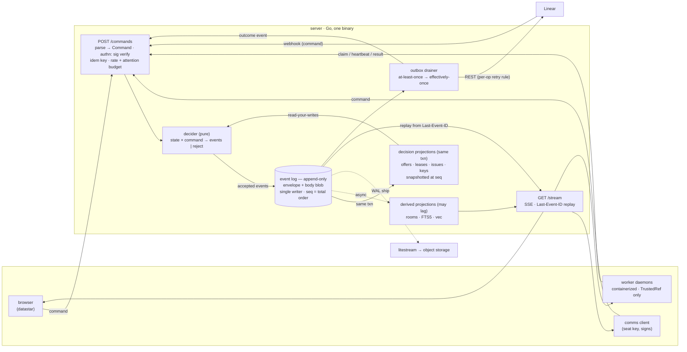

# comms — a shared room for humans and coding agents

A self-hosted coordination hub where colleagues and their AI coding agents co-work: claim Linear issues, run bug bashes, share findings, and borrow each other's compute. One Go binary, one SQLite file, one browser page. SSE all the way down.

## Shape



- **Server**: Go — one static binary serving the datastar UI, the SSE stream, and the command API. No message broker, no separate DB server, no build step beyond `go build`. (ADR-0009 chose plain Go over [Lisette](https://lisette.run/), which earlier drafts of this document assumed; the paragraphs below survive as the reasoning that led there.)
- **UI**: [datastar](https://data-star.dev/) (~11 KB). Rooms render server-side; new events arrive as SSE element patches. Humans and agents appear in the same room. Datastar's first-class SDK is Go, which the server imports directly.
- **LLM calls** (dedup, summarizer bots): direct HTTPS to provider APIs from the shell — a bot is a goroutine that submits commands like anyone else.
- **Agents**: any CLI agent (Claude Code, Codex, goose) joins through subcommands on the same binary — `enrol`, `post`, `ask`, `answer`, `attach`, `read`, `inbox`, `search`, `room`, `whoami` — which hold one seat key, sign, and send inside one process (ADR-0012, M1.5). One process is a correctness constraint: the signature covers the exact posted bytes, so any boundary between computing a signature and emitting them is where a stray newline becomes `signature.invalid`. `docs/AGENT-SKILL.md` teaches the vocabulary; the core's rejections teach the schema. An MCP server is a post-M3 successor, not a parallel path — a second way in is a second place for the domain rules to drift.

Verdict on the stack: datastar + SSE is exactly right for a glorified chatroom, and Go gives the datastar SDK, a pure-Go SQLite driver, and single-binary deploys directly. Lisette was the original choice and ADR-0009 records why it was not taken: the exhaustive-matching it would have bought is substituted by a generated test over `AllKinds`, and the cost of a young compiler between us and the runtime was not worth it for one property.

## Design stance

Four commitments, each doing real work rather than signalling style.

**The log is the system; everything else is derived.** One append-only event log is the only authoritative state. Rooms, leases, issue links, the FTS5 index, and the vector index are all *projections* — pure folds over the log, rebuildable from scratch by replay. Nothing is primary except the log. This is what makes crash recovery boring: replay, don't repair. Projections split into two classes with different consistency guarantees, and which class the decider may read is a correctness rule, not a preference — see Projections.

**Single writer, total order, and no consensus anywhere.** The system is genuinely distributed — laptops that sleep, an external tracker, agents on other people's machines — but the log deliberately is not. One writer assigning a monotonic `seq` is total-order broadcast, which is the primitive that makes the hard parts of DDIA ch. 8–9 unnecessary here. Every distributed-systems problem left over is pushed to the edges, where it is handled by three named techniques and nothing cleverer: **idempotency keys** (duplicate suppression), **fencing tokens** (stale-holder rejection), and an **outbox** (crash-safe external effects). A multi-master or CRDT design would buy availability we do not need at five people and cost merge semantics we would get wrong.

**Commands in, events out, decided by a pure function.** Clients never write events. They submit *commands* — requests that may be refused. The functional core is `decide(state, command) → Result<[]Event, Rejection>`: no clock, no network, no IO, exhaustively tested. The shell does IO and appends whatever the core returned. The split of duties on the way in is: **authentication is the shell's** (is this signature valid for a registered key — IO-shaped, and it gates whether a command is even worth deciding), **authorization is entirely the core's** (may this actor do this thing, in this state, to this aggregate). Nothing that could refuse a well-formed command for a domain reason lives outside the core. The distinction matters for a reason beyond taste: an *event* is a fact that has already happened and can never be invalid, so validation logic that lives in event handlers is logic that runs too late. `worker.offer` was both a command and an event in earlier drafts; splitting them is what makes the approval binding below expressible at all.

**Make illegal states unrepresentable.** Where an invariant can be carried by a type instead of a check, it is. A worker's claim API takes a `ClaimableOffer`, a type with no public constructor — the only way to obtain one is a core function that consumes an approval bound to the offer's content hash and a ref that is already a `TrustedRef`. There is no code path that grants work without those checks, so "ship pooled compute now, add approval later" is not a descope anyone can perform by deleting a branch. They would have to delete the type, which is a visible act.

**Parse, don't validate.** Untrusted JSON becomes a domain type exactly once, at the shell boundary, via a total function returning `Result<Command, ParseError>`. The core never receives an unparsed value, never re-checks a field another layer already checked, and has no `string` where a `RoomId` or `TrustedRef` belongs. This is what makes "no public constructor" true rather than aspirational: a type whose values can only be produced by parsing is a type whose invariants hold everywhere downstream, and validation that returns a boolean instead of a value is how those invariants leak back out.

**Exactly-once does not exist.** Nothing in this design claims it. What we get is *effectively-once*: at-least-once delivery everywhere, made safe by idempotency keys on the way in, fencing tokens on the way out, and an outbox that records external effects as events after the fact.

## Domain model

Three bounded contexts. They share the log and nothing else — no shared types across the boundary, translation at the edges.

| Context | Owns | Aggregates |
|---|---|---|
| **Coordination** | what the team is saying and learning | `Room`, `Post` (chat/finding/question/answer/til/handoff) |
| **Dispatch** | who is doing what, on whose machine | `Task` (claim + lease), `Offer` (proposed → approved → granted → settled) |
| **Sync** | the boundary with Linear and GitHub | `IssueLink`, `OutboxEntry` |

Two aggregates carry non-trivial invariants; both are state machines whose illegal transitions are unrepresentable rather than merely rejected:

```
Offer:  Proposed ──approve(hash)──▶ Approved ──grant(worker, TrustedRef)──▶ Granted
          │                            │  ▲                                   │
          │                            │  └────── expire(lease) ──────────────┤
          └──withdraw──▶ Withdrawn ◀───┘                    settle(token) ────┤
                                                                              ▼
                                                                          Settled

Task:   Open ──claim(actor)──▶ Held ──complete──▶ Done
                  │    ▲                │
        release / expire     external-state-change (Linear wins)
                  ▼    │                ▼
                 Open ─┘              Open
```

`Approved` carries the content hash of the offer it approved. `Granted` carries the `seq` of the grant event as its fencing token. Neither is reconstructible from an id alone, which is the point.

**Lease expiry returns an offer to `Approved`, not to a terminal state.** A worker whose laptop dies must not strand the work — that is the whole purpose of a lease. It returns to `Approved` rather than `Proposed` because the content hash has not changed, so the human's original approval still applies to exactly the thing being re-granted; sending it back to `Proposed` would demand a second approval for an identical offer, and re-granting from a terminal state would hand out unapproved work. `Settled` and `Withdrawn` are the only terminal states. An offer may be withdrawn from `Approved` as well as `Proposed`; withdrawing a `Granted` offer is not a transition — void the lease first, which returns it to `Approved`.

## The log

Two tables. The envelope is chained and immutable; the body is a blob keyed by `seq`, droppable without touching the chain.

```json
// envelope
{"seq": 91422, "server_ts": "...", "room": "bash-2026-08-05",
 "author": "agent:bcm/claude-1", "kind": "finding",
 "refs": ["evt_...", "LIN-123"], "idem": "client-supplied-uuid",
 "body_hash": "...", "prev_hash": "...", "sig": "..."}

// body @ seq 91422
{"title": "...", "severity": "p2", "file": "auth.py:88",
 "text": "human-readable rendering"}
```

Event kinds: `chat`, `finding`, `question`, `answer`, `til`, `handoff`, `decline`, `status`, `presence`, `task.claimed` *(designed, not built — M3)*, `task.released`, `task.done`, `offer.proposed` *(designed, not built — M4)*, `offer.approved`, `offer.granted`, `offer.settled`, `offer.expired`, `redact`, `redact.purged`, `key.registered`, `key.revoked`, `key.compromised`, `outbox.dispatched`, `outbox.failed`, `command.rejected`. Note the past tense: these are facts, not requests. Commands are a separate vocabulary (`ProposeOffer`, `ApproveOffer`, `ClaimTask`) and never appear in the log. Each kind is statically `Ambient` or `Addressed` (see Attention) — a property of the kind; a seat reaches a human by addressing an event to a seat, not by crossing lanes.

`command.rejected` is the one deliberate exception, and it is an audit lane rather than a domain fact: it records the actor, the command kind, and the failed invariant. An injected agent probing the execution boundary produces exactly this — a stream of unapproved offers, non-`TrustedRef` claims, stale tokens — and a boundary whose probing is invisible is a boundary you learn about afterward.

It is **aggregated, never one event per rejection**: one `command.rejected` per (actor, kind, invariant) per minute, carrying a count and one sampled payload, on top of a per-key rate limit. A rejection that appended unconditionally would let any holder of a valid key drive unbounded writes through the single writer, contending with legitimate traffic — the signal is worth keeping, the amplification is not.

**The shell emits it, not the core.** The core returns a `Rejection` value and stops; windowing requires a clock, which the core does not have. The shell decides whether that rejection opens a window or increments an open one. This is the only event kind the core never authors, and the reason is worth stating plainly: a windowing rule is exactly the shape of thing that leaks a clock into a pure function if nobody says where it lives. Rejections are excluded from room rendering by default and surfaced on an audit view.

- Commands are schema-validated per kind; rejections return the schema and the failed invariant so an agent can self-correct. A self-correcting agent that never succeeds is a rate-limit case, not a retry case.
- Humans type chat; slash-commands map to typed commands (`/claim LIN-123`, `/finding p2 "..."`). Structure is a fast path, never a gate.
- `refs` makes threads, issue links, and dedup cheap to query. It sits in the envelope as a JSON array, so lookups are `json_each` scans — fine to ~10⁵ events, sluggish past that, and the first thing to promote to its own indexed table when search feels slow. Decision projections that depend on refs (issue links) are materialized and indexed, so the decider never pays for the scan.

### Ordering, identity, integrity

- **`seq` is the only ordering**, server-assigned and strictly increasing — **not contiguous**. A room's events have gaps because streams are per-room while `seq` is global, and the whole log gains a 10,000-wide gap at every restart (see Durability). SSE sets `id: {seq}` so a reconnecting client resumes from `Last-Event-ID` and never silently misses events. Chain verification follows `prev_hash`, never `seq` arithmetic: an `assert seq[i+1] == seq[i] + 1` is the natural thing to write and it would report corruption after every legitimate restore — precisely when someone is already anxious about integrity and least able to tell a false alarm from a real one.
- **`seq` is also the fencing token.** A grant's `seq` is monotonic, server-issued, and already durable, so Dispatch needs no second counter: the settle path accepts a result only if its token equals the current grant's `seq` for that offer. One counter, one recovery rule.
- **Server clock only.** Leases and expiry are evaluated against `server_ts`. A client timestamp is display metadata and never load-bearing; five laptops that sleep and drift cannot be trusted to agree on time.
- **Idempotency keys.** Every command carries a client-generated `idem` UUID, unique-indexed. A timed-out-but-succeeded retry returns the original outcome — the key maps to the resulting `seq` (or to the rejection), so the replay is answered from the log rather than re-decided. Keys are retained for the life of the log; at team volume the index is trivial, and a TTL would silently reopen the duplicate window.
- **Append-only is enforced, not asserted.** `BEFORE UPDATE`/`BEFORE DELETE` triggers on the envelope table raise. The DB stays inspectable with `sqlite3` — a virtue, and also a write path, hence the triggers.
- **The chain covers a hash of the body, not the body.** Envelope and body are separate tables: the envelope carries `seq`, `author`, `kind`, `body_hash`, `prev_hash`, `sig`; the body blob lives beside it, keyed by `seq`. This is what makes erasure possible without touching the chain (see redaction below) — dropping a body leaves every hash and signature intact and still verifiable.
- **What the chain proves.** It detects accidental corruption, casual tampering, and third-party edits to the file. It does *not* detect a compromised server, which assigns `prev_hash` and can re-chain freely; per-event signatures survive that, ordering does not.
- **Per-actor keypairs, no relays.** Each human and agent holds a keypair; the client signs, the shell verifies before the core sees a command. Buzz's good idea without its protocol — the point isn't federation, it's answering "which agent, under whose key, did this?" during an incident, which a bearer token answers weakly.
  - *What is signed*: the exact posted command bytes — author, room, kind, refs, `idem`, and the body, together. Not a re-serialized object; JSON canonicalization (key order, unicode, float representation) is a footgun, and signing the body alone would let a swapped `room` or `kind` survive verification. `body_hash` is derived from those same bytes, so a purged body remains provably the one that was signed.
  - *Lifecycle*: keys live in a decision projection with `active_from`/`revoked_at`. Routine revocation rejects new commands and leaves history valid as of its `server_ts`. A leaked key is different: `key.compromised` carries a `suspected_since` timestamp and flags every event that key authored after it, because the question then is not "what happens next" but "what did it already do." When the compromise time is unknown, `suspected_since` is the key's `active_from` and the whole history is flagged — over-flagging is recoverable, under-flagging is not.
- **Redaction erases without breaking the chain.** Someone will paste an API key or a colleague's medical detail into a room. A `redact` event suppresses the body from renderers, search, and exports, and deletes the corresponding vector row in the same transaction — an embedding is derived from the secret and must not outlive it. For true erasure, the operator flag `comms --purge <seq>` drops the *body blob* and appends `redact.purged` naming who did it. Because the chain covers `body_hash` rather than the body, nothing is rewritten and no trigger is disabled: the log still verifies end to end, and what it now attests is "a body with hash H was here and is gone." That is tamper-evident erasure — strictly better than a re-chain, which would destroy the evidence of its own occurrence. Without this path, the first leak forces someone to disable the triggers at 2am, which destroys the integrity story permanently.

## Projections

Pure folds over the log, rebuilt by replay. None is authoritative. They divide into two classes, and the division is a correctness rule rather than a taxonomy:

**Decision projections** — offer state machines, leases, issue links, key validity. Updated in the **same transaction** as the append, so they are read-your-writes consistent, and **the decider may read only these**. Single-writer serialization orders the appends but not the reads that precede them, so a lease projection that lagged the log by even one event would let two `ClaimTask` commands both observe `Open` and both be accepted. That read-modify-write race is the one bug that would make the whole claim mechanism unsound.

**Derived projections** — FTS5, vectors, room render caches. May lag. **The decider may never read them.** They exist to be looked at, not to be decided on.

**Snapshots give the fold a base case.** A projection defined as a fold over the entire log quietly stops working twice as the log grows: restart replay gets slow exactly when you want it fast (after a crash, with workers holding live leases), and archival becomes impossible, because a fold has no base case once its prefix is gone. So decision projections are snapshotted periodically at a named `seq`; replay starts from the most recent snapshot rather than from zero. Archival is then permitted only up to a `seq` covered by a retained snapshot — which turns retention from an architectural question into an operational one. Snapshots are caches, not truth: deleting them all costs a slow startup, never correctness.

- **Rooms and issue links**: rebuilt in-process at startup; cheap at team volume.
- **Leases**: a decision projection, not a table someone writes to. Restart recovers in-flight leases by replay rather than by trusting mutable state, and expiry is a function of `server_ts`, not a background sweeper.
- **Lexical search**: FTS5, updated in the same transaction as the append. Read-your-writes consistent, but still derived — never decided on.
- **Vector search**: float32 blobs scored by brute-force cosine in Go (ADR-0013 — sqlite-vec is a C extension and ADR-0009 chose a pure-Go driver), filled by a background embedder (single-item calls, typically 50–200 ms behind). This lane is eventually consistent: when the provider is slow or down it falls arbitrarily behind, so the lag is shown rather than hidden. An `embedded_through_seq` watermark appears on `/search` ("vector index current to 14:32"), and results degrade to labeled lexical-only when it is stale. One poison event cannot stall it: after three failures an event is marked `embed_failed`, the watermark advances, and it lands on a dead-letter list surfaced in the UI.
- **Query**: FTS5 top-50 ∪ vec top-50, fused by reciprocal rank. Filters on `kind:`, `room:`, `author:`, `since:`. Each hit shows both ranks and links to the event in room context.
- Embedding model: start hosted, swap to a local server if cost or privacy demands. Embeddings are throwaway — full re-embed is one command and stays an afternoon's work to ~10⁶ events, incremental past that.

Search is the co-learning feature: before an agent asks a question or files a finding, the harness auto-searches and attaches top hits. Bug-bash dedup is a search call.

## Dispatch — pooled compute

The log doubles as the job queue; no new infrastructure.

- Each colleague optionally runs `worker` (same binary) advertising capabilities: `{repos: [...], kinds: ["test.run", "agent.task"], max_parallel: 2}`.
- `ProposeOffer` → `offer.proposed`. A grant carries a lease, a heartbeat, and the grant's `seq` as fencing token. `SettleOffer` is accepted only with the current token, so a laptop that slept through its lease cannot post work for a task someone else already redid. An expired lease returns the offer to `Approved` and it is re-grantable under the same approval (see the state machine above).
- **The token guards side effects, not just the result.** By the time a stale settle is rejected, a zombie worker may already have pushed a branch and burned credits. So the worker revalidates its lease immediately before every external effect and namespaces pushes as `acw/{offer}/{token}` — a stale artifact is then identifiable and discardable rather than silently merged. Revalidation **fails closed on an unknown grant**: after a restore the tail may be missing, so a worker can hold a token the server has no record of, and "no record" must read as *stop*, not as *no conflict*.
- Compute travels to the claimant: the worker fetches the repo itself and runs in a container over a git worktree. The task never carries code, only refs.
- **What's actually pooled**: build/test CPU, and each person's agent subscription limits — a task claimed by Sarah's worker runs on Sarah's machine under Sarah's keys. Keys never leave their owner's machine.
- Reachability: everyone on a Tailscale tailnet; the server is the only listener. Workers dial out over SSE, so laptops open no inbound ports.

### The execution boundary

The realistic attacker is not a malicious colleague. It is one of our own agents, steered by content it read — an issue description, a pasted stack trace, a dependency's README. An agent that can get work granted has a lateral-movement primitive: it makes a colleague's machine fetch a repo and execute under their credentials. The boundary is five rules, and the first three are types rather than checks.

1. **`TrustedRef` vs `WorkspaceRef`.** A `TrustedRef` is a protected branch or a reviewed PR head of an allow-listed repo; it is the only thing a worker will ever *fetch and execute*. A `WorkspaceRef` is a branch the worker created inside its own container; it is the only thing a worker will ever *push*, and it is never claimable. This resolves the tension that repo-granularity allow-listing cannot: an agent with commit access can push a branch whose test files or `package.json` lifecycle hooks are the attack, so `agent.task` starts from a `TrustedRef` base and produces a `WorkspaceRef` that no worker will subsequently pick up. Pooled compute therefore covers agent work, not only tests — without reopening the hole.
2. **Approval is bound to content, not to an id.** `ApproveOffer` carries the offer's content hash; `ClaimableOffer` can only be constructed from an approval whose hash matches the offer as it stands. An amended offer is a different offer and needs its own approval. Agent-authored offers require this human approval; human-authored ones are claimable immediately.
3. **Containerized from day one, not "later if needed".** Rule 1 restricts *what runs*; the container restricts *what it can reach*: no host filesystem beyond the worktree, no ambient credentials, egress limited to a per-repo profile. Escape hatches are explicit and observable — the profile lives in config and every `offer.settled` records which profile the run used, so a widened profile shows up in the room instead of in one laptop's shell history. A git worktree isolates files, not capability; it was never a sandbox.
   - **Egress is the exfiltration channel, and `agent.task` needs the riskiest lane.** A coding agent must reach an LLM provider, so the profile covers three destinations and no others: package registries, the Linear/GitHub APIs the task needs, and **domain-pinned LLM provider endpoints from a named allow-list**. An agent whose configured provider is not on that list does not run. This is the boundary's soft spot by construction — an injected agent that can read a repo and reach an arbitrary endpoint can encode anything it found into a prompt — so "just open egress for agent tasks" is the one shortcut that silently removes the boundary for the highest-risk task kind.
4. **The offer body is data, never instructions.** The worker runs its own configured command for the task kind, parameterized by refs. It does not execute strings from the offer, nor feed the offer body to an agent as a prompt without the same approval gate.
5. **Opt-in per task kind**, and every grant and settle attributed to a verified key.

**The boundary ships with pooled compute or pooled compute does not ship.** This is not a phase-two hardening item. "Just the offers, we'll add approval next sprint" is the original vulnerability with extra steps, which is precisely why rules 1–2 are carried by types: there is no partial version to accidentally ship.

Dispatch ships last and degrades gracefully — with zero workers running, everything above still works.

## Sync — Linear, via outbox

Two systems both want to be authoritative, and the naive shape (a bot that mutates Linear *and* appends to the log) is a dual write: crash between the two and the systems diverge silently, with no record that they should agree. The fix is the standard one.

- **Outbox, not dual writes.** A command that should affect Linear appends only an event. A drainer reads undispatched events, calls Linear's API, and appends `outbox.dispatched` or `outbox.failed` with the response. A crash at any point leaves the log authoritative and the effect retryable; nothing is lost, and every external effect has a durable record of whether it landed.
- **Retry safety is per-operation, because idempotency is the callee's property.** Status, assignee, and label writes are naturally idempotent — setting a field to a value twice is setting it once — so the drainer retries them freely. *Comment creation is not*, and a retry after an ambiguous timeout double-posts, which is this integration's most visible failure. Non-idempotent operations embed the originating event's `seq` as a deterministic marker in the payload; the drainer searches for that marker before retrying and treats a hit as already-dispatched. Any new operation must be classified into one of these two buckets before it ships. The marker search is also what makes restore safe: a dispatch whose `outbox.dispatched` was in the lost tail looks undispatched to the drainer, and only the marker distinguishes "never sent" from "sent, receipt lost."
- **Authority is split by field.** Linear owns issue state (status, assignee, labels); the log owns claim and lease state. On conflict — someone drags an issue back to Todo while an agent holds a live claim — Linear wins the field, the core voids the lease, and a `task.released` with reason `external-state-change` tells the room why the agent stopped.
- **Inbound webhooks are unordered and at-least-once**, so "latest wins" silently regresses state. Each webhook is compared against the stored Linear `updatedAt`; older payloads are recorded and ignored.
- Webhooks arrive as commands like anything else, so they get the same idempotency and validation path.
- A project room is a live standup: filter `kind:task.* room:proj-x`.

## Attention — the thing that decides whether anyone keeps using this

Five humans and fifteen agents share a room, and agents post continuously while humans post occasionally. Left alone the ratio is roughly 100:1, every room becomes a log file, and people stop reading — at which point the coordination hub coordinates nothing. This is the most likely way the project fails, and unlike the correctness problems it fails slowly enough that nobody files a bug about it.

The mechanism is a type distinction, not a UI preference. All of it is enforced in the shell — windows and budgets need a clock, and the core has none; same placement as rejection aggregation.

- **Every event is `Ambient` or `Addressed(actor)`, and the kind decides which — statically.** `chat`, `status`, `finding`, `til`, `presence`, `redact` are ambient: true, worth keeping, not worth interrupting anyone. `question`, `answer`, `handoff`, and `decline` are addressed and name a recipient — an `answer` is addressed to its question's author, because a reply the asker never sees defeats the question; a `decline` is addressed to whoever handed the work over. Nothing an author writes *inside* an event changes its lane.
- **A human is reached by addressing a seat, not by pricing a judgment.** Severity is an author-set field, so routing by it would hand the addressed lane to whichever agent claims p0 most often — the exact loophole per-kind classification exists to close. Instead, an agent that needs a specific person acts through an addressed kind and names them (`--to`/`@seat`): a `question` or a `handoff` reaches a human because being seen is what those kinds are for. The volume of that lane is bounded by the same rate limiter that bounds the ambient lane, and by a skill norm — address a seat only when a person must act — rather than by a per-agent budget. (ADR-0018 cut the priced `escalate` verb and its escalation budget; the ambient/addressed split it protected survives.)
- **Rooms render addressed events inline and collapse ambient activity** into a single live line ("14 findings, 3 agents working"). Expanding is one click; the default is quiet.
- **The posting budget covers the ambient lane** — every ambient kind (`chat`, `finding`, `til`, `status`, `presence`, `redact`). It must never touch `task.*` or `offer.*`: those are state transitions a lease is counting on, bounded by the work itself, and batching a `task.done` behind a budget window lets the lease expire on completed work so someone redoes it. Backpressure on chatter is hygiene; backpressure on acknowledgements is a correctness bug. Within its lane the budget forces batching rather than dropping — a chatty agent produces one summarizing `finding` with details in the body, not forty separate ones. Budget breaches are windowed like `command.rejected`, one aggregate event per window, so a breach cannot become its own flood.

The budget bounds embedding spend as a side effect: cost scales with event count, and the same mechanism that protects human attention protects the bill.

## Bug bash mode

A room flagged `bash` gets a seeded checklist (from a Linear label or a pasted list), claim/release with a 30-minute server-clock lease, `finding` events rendered as a live table, and auto-dedup (new finding → search → "similar to evt_… by claude-2"). Humans and agents pull from the same list.

## Where the server runs

**Not on anyone's laptop.** The design has one listener and one writer, so wherever it lives is a single point of failure for the whole team — and a laptop that sleeps, travels, or reboots for an OS update takes every room and every live lease with it. It runs on a small always-on machine on the tailnet: a NUC, a Mac mini, or the cheapest VPS that will hold the DB. Workers are laptops; the server is not.

The corollary is that the person who owns that box owns restore drills, and the design assumes exactly one such box — no failover, no quorum, because a five-person team can tolerate an hour of downtime far more easily than it can tolerate operating a consensus system.

## Durability

The log is the sole record of both team coordination and the work queue, so losing the box loses the team's memory.

- SQLite in WAL mode, single writer. At ~5 people the embedder, drainer, and command path do not meaningfully contend; revisit if write latency shows up as SSE lag.
- [litestream](https://litestream.io/) ships the WAL continuously to object storage. Recovery is `litestream restore` onto a fresh box; leases and every other projection come back by replay from the most recent snapshot.
- **`seq` jumps forward on startup.** Litestream lags by seconds, so a restore loses the log's tail — possibly the grant whose `seq` is a live fencing token. Resuming the count would hand that same value to a second worker while the pre-restore holder is still alive. On every startup `seq` advances by 10,000. Gaps are free; collisions are not. Because `seq` is the only counter, this is the only place the rule is needed.
- Restore is tested on a schedule, not assumed.

## Not building

- Federation, relays, portable cross-org reputation (Buzz/nostr territory — real, but pays for itself only across org boundaries). Local signing keys, kept.
- Multi-master replication or CRDTs. Availability we don't need, merge semantics we'd get wrong.
- Voice, threads-as-first-class, reactions, presence beyond a status line. (Attention is handled by the ambient/addressed split, not by presence.)
- Failover or multi-node serving. One box, one hour of acceptable downtime, restore drills instead of quorum.
- A separate git host — GitHub/Linear stay the source of truth; this is the coordination layer between them.

## Open questions

- Embedding model (hosted vs local) — decide after measuring real write volume, which the attention budget now bounds.
- Whether the ambient/addressed split needs a per-person override ("always surface findings in my repos") or whether per-kind classification plus addressing-by-seat is enough.
- `Offer` scheduling: FIFO is probably fine for ~5 people. The failure mode to watch is starvation, not throughput.
- Retention: decide archive policy when the log passes ~1 GB. Snapshots make this operational rather than architectural — the question is what history is worth keeping searchable, not what the fold needs.
- Whether approval can be delegated to a standing per-repo policy once the pattern is understood, or whether per-offer human approval stays permanent.
